# Guia de Uso do Aplicativo GeoTransportes

Este documento descreve o fluxo operacional completo, dividido entre as ações do **Administrador/Administrador de Programação** e do **Motorista**.

As capturas de tela fornecidas pelo usuário devem ser copiadas para `docs/fluxos` e referenciadas abaixo. Cada seção inclui links Markdown para as imagens correspondentes; adicione os arquivos com nomes claros (ex.: `login.png`, `programacao.png`, `torre-controle.png`, `montagem.png`, etc.).

> **Observação:** você pode arrastar os screenshots que enviou anteriormente para essa pasta ou renomeá-los conforme a sequência de uso.

---

## 1. Fluxo do Administrador

1. **Acessar o sistema**
   - Login com usuário administrador.
   - 
     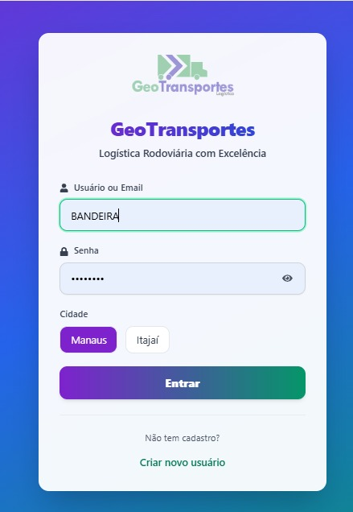
   - Ao entrar, a página inicial apresenta ações rápidas e atalhos.
   - 
     

2. **Criar/Importar Programações de Entrega**
   - Navegar até *Programação de Entregas* (menu de agendamentos).
   - 
     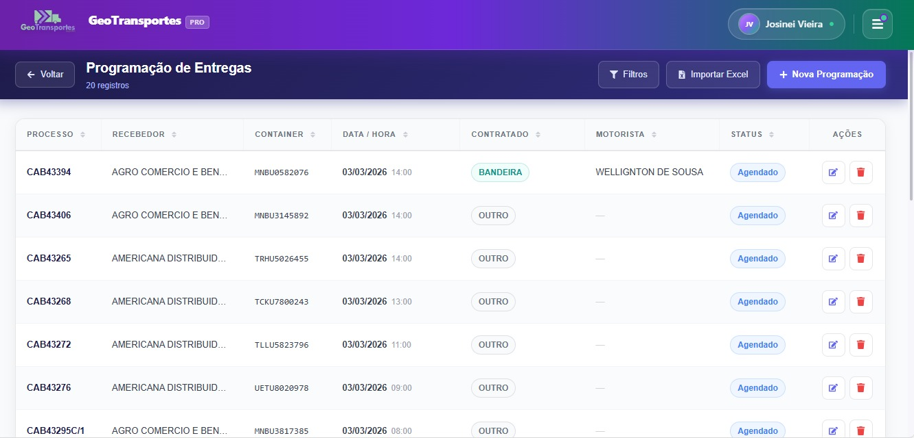
   - Clicar em **"Nova Programação"** para inserir manualmente ou usar **"Importar Excel"** para upload em massa.
   - Preencher dados: processo, recebedor, container, contratante, motorista, data/hora e demais detalhes.
   - Salvar a programação.
   - O sistema permite revisar e editar antes de finalizar.
   - 
     

3. **Atribuição automática aos motoristas**
   - Cada entrega agendada é automaticamente relacionada à transportadora/contratado especificado.
   - Motoristas vinculados ao contratado (por exemplo, `BANDEIRA`) receberão as entregas no aplicativo móvel.

4. **Acompanhamento operacional (Torre de Controle)**
   - A página **Torre de Controle** mostra o resumo operacional (programadas, agendadas, motoristas) e uma tabela detalhada com status e progresso.
   - 
     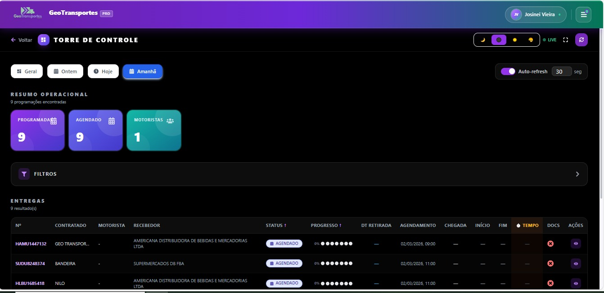
   - Usar filtros por data, motorista, status para monitorar atividades.
   - Atualizações em tempo real (auto-refresh configurável) mostram mudanças realizadas pelos motoristas.

5. **Outras funcionalidades**
   - Editar ou excluir programações.
   - Visualizar documentos enviados e anexos.
   - Gerenciar transportadoras, motoristas e configurações gerais.

---

## 2. Fluxo do Motorista

1. **Login**
   - Abrir o aplicativo/web e acessar com **usuário da transportadora** (por exemplo, `BANDEIRA`) e senha.
   - Selecionar cidade (Manaus ou Itajaí).
   - 
     
   - Após login, o motorista é direcionado ao painel inicial.
   - 
     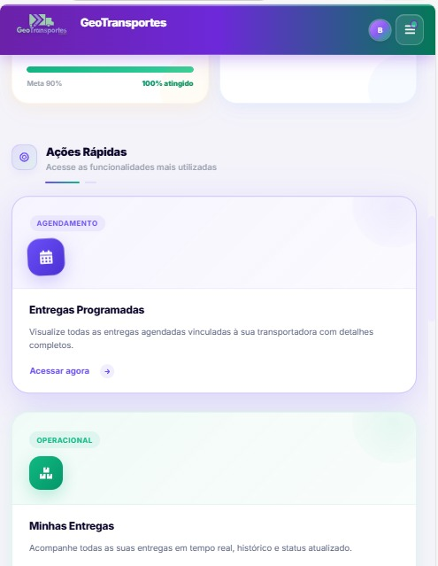

2. **Entregas Programadas**
   - O menu "Minhas Entregas" ou o atalho leva à tela de **Entregas Programadas**.
   - Todas as entregas pendentes para sua transportadora ficam listadas.
   - 
     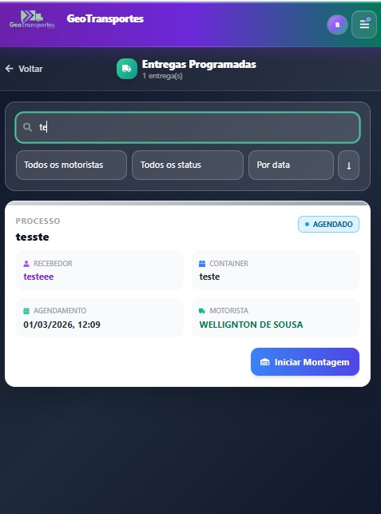
   - Usar campo de busca e filtros (status, motorista, data) para localizar a entrega desejada.

3. **Montagem do Container**
   - Após encontrar a entrega, clicar em **"Iniciar Montagem"**.
   - Abrirá um modal com informações sobre o processo e o botão para anexar **comprovante de montagem** (foto do cheio).
   - 
     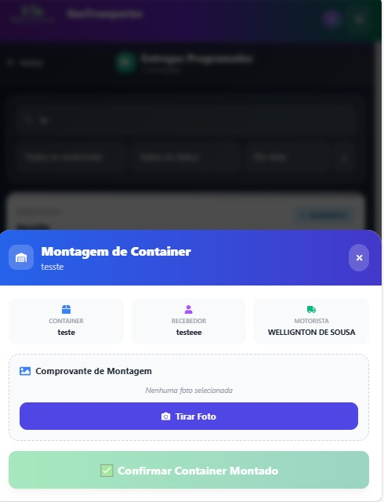
   - Fazer upload da foto e confirmar com *"Confirmar Container Montado"*.
   - O status da entrega muda para `CONTAINER_MONTADO`.
   - O motorista volta automaticamente para a lista.
   - 
     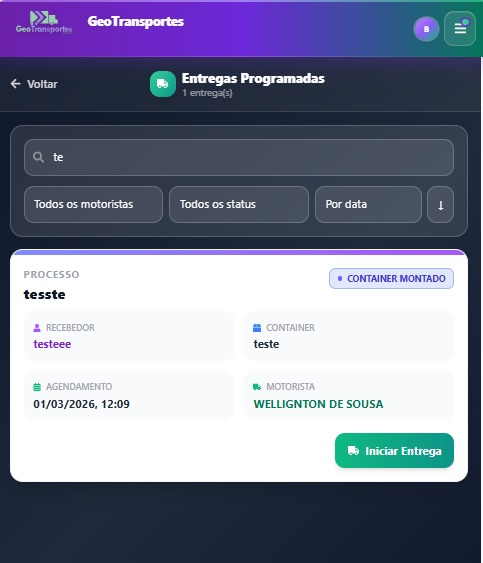

4. **Iniciar Entrega / Fluxo de Entrega**
   - No momento em que estiver a caminho do cliente, localizar a mesma entrega e clicar em **"Iniciar Entrega"**.
   - Aparece a barra de progresso com etapas: *Chegada* → *Desova* → *Progresso* → *Devolução* → *Docs*.
   - 
     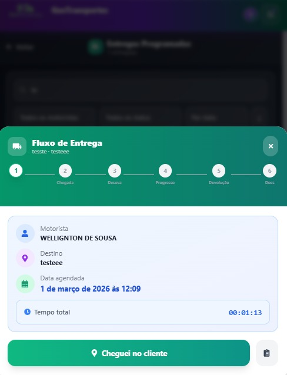
   - Seguir as etapas na ordem:
     1. **Cheguei no cliente**: registra a hora de chegada e permite anexar fotos do local.
        
        
     2. **Desova**:
        - Confirmar *início da desova* e depois *fim da desova*.
        
        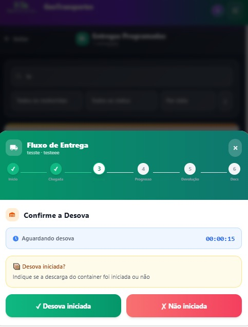
     3. **Progresso**: etapa transitória.
     4. **Devolução do Container**:
        - Ao finalizar a desova, opção para **agendar devolução** (notifica admin) ou apenas continuar.
        
        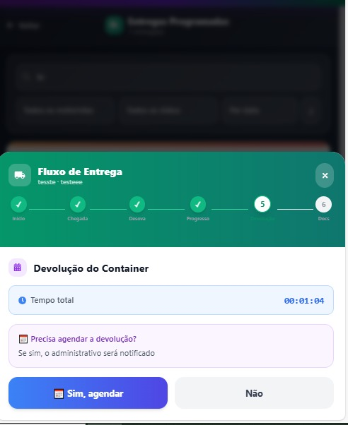
     5. **Documentos Finais**:
        - Fazer upload de `Canhoto CTE`, `Canhoto NF` e `Diário de Bordo`.
        - Caso algum documento não esteja disponível (cliente reteve), escrever justificativa (como se faz no grupo de mensagens).
        - Clicar em **"Documentos enviados"** para finalizar a entrega.
        
        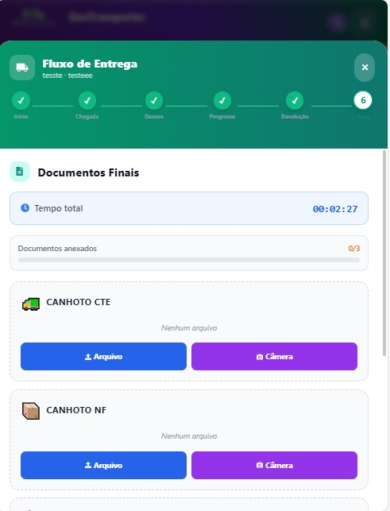
   - Ao concluir, o status atualiza para `PENDÊNTE DEVOLUÇÃO` e a entrega some da lista de programadas.

5. **Devolução do Container**
   - Qualquer motorista da mesma transportadora pode realizar a devolução.
   - Basta abrir a tela **Entregas Programadas**, buscar a entrega com status `PENDÊNTE DEVOLUÇÃO` e clicar em **"Devolver Container Vazio"**.
   - 
     
   - Anexar foto do comprovante de devolução e confirmar. A entrega é removida totalmente da lista.
   - 
     

6. **Documentos Pendentes**
   - Se algum documento ficou faltando no passo 4, a entrega passa a figurar na tela **Documentos Pendentes**.
   - 
     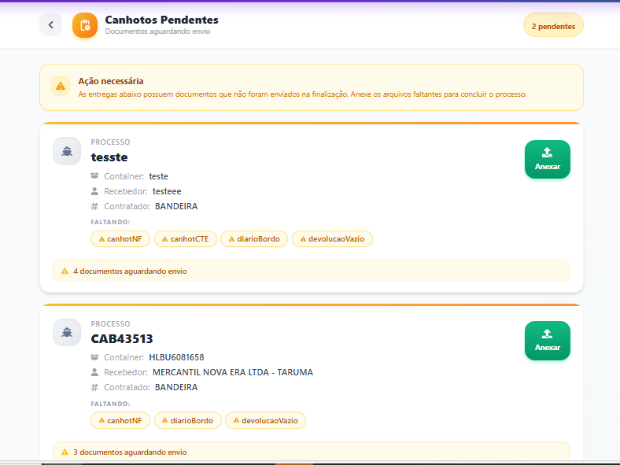
   - Depois de obter o documento faltante, acessá-la nessa tela e anexar o arquivo para fechar o fluxo.

---

### Observações importantes
- Todas as ações do motorista atualizam automaticamente a Torre de Controle do administrador.
- As imagens enviadas ficam armazenadas (local ou no S3/R2) e acessíveis via modal de documentos.
- O tempo presente em cada etapa é exibido para controle operacional.
- O sistema permite filtrar entregas concluídas, pendentes, canceladas e com documentos entregues.

---

Este passo‑a‑passo reflete a operação padrão mostrada nas telas anexadas pelo usuário: login, programação, torre de controle, modal de montagem, fluxo de entrega com fotos, justificativas e devolução.

Coloquei o material em **`USO_DO_APP.md`** no repositório. Sinta‑se livre para complementar ou reorganizar conforme a necessidade.